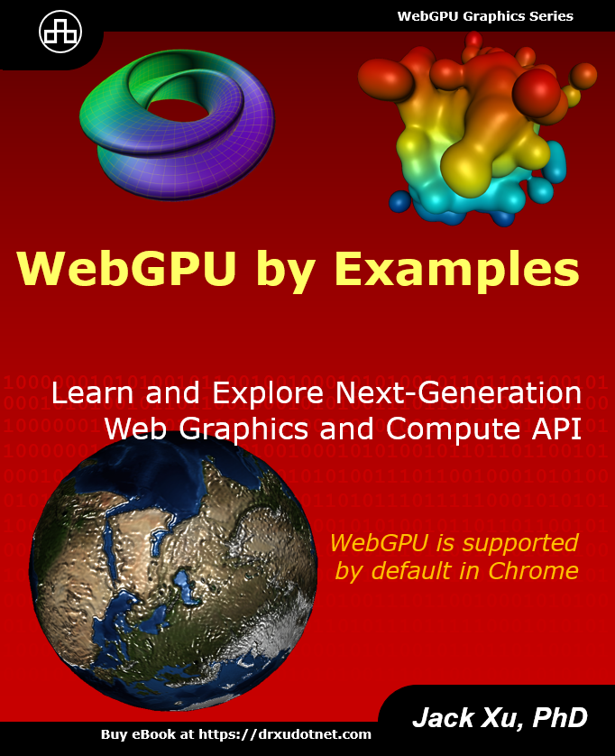

# WebGPU Starter Template

This is a starter template for WebGPU, which will be used to build the sample projects in the book "WebGPU by Examples". For details about this book, please visit [https://drxudotnet.com](https://drxudotnet.com). It can also be used as a starting point for creating any WebGPU applications using TypeScript and WebPack. 

<p align="center">
<a href="https://drxudotnet.com"></a>
</p>

## Getting Started

After cloning the repository run

```
npm install
```

to install webpack and other npm packages, then you can run the serve task and point your browser to `localhost:8080`:

```
npm run serve
```

You can also compile this sample in different modes with the following commands:

In the development mode:
```
npm run dev 
```

In the production mode:
```
npm run prod
```

Or in the watch mode:
```
npm run watch 
```

